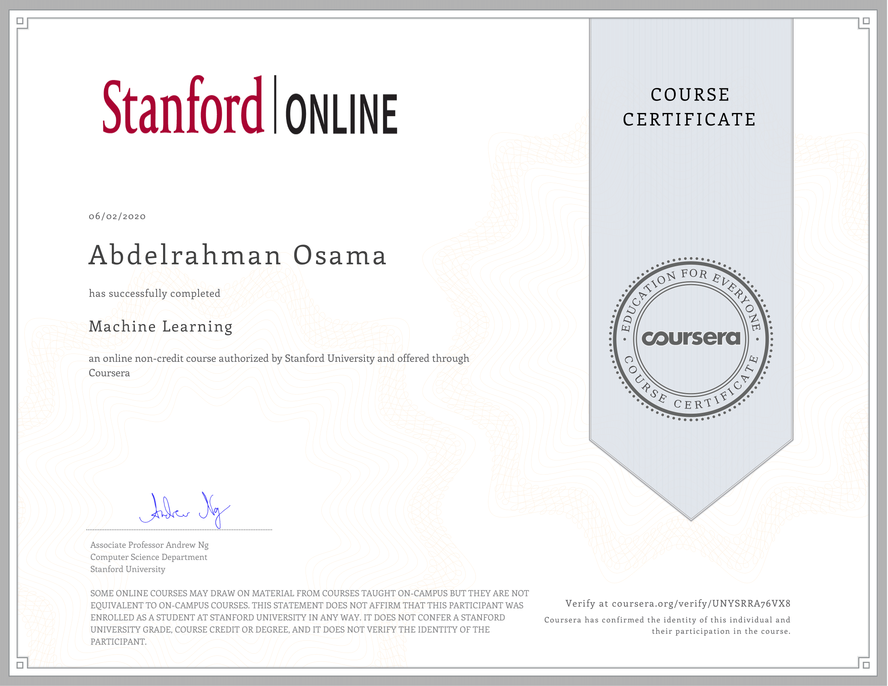

# [Coursera Machine Learning MOOC by Andrew Ng](https://www.coursera.org/learn/machine-learning) 

These are my assignment submissions to the course done in python.

**Name:** Abdelrahman Osama

**E-mail:** abdelrahman.osama93@gmail.com

----------

## My lecture notes

- [Regression](https://github.com/aosama16/Coursera-Machine-Learning/blob/master/Lecture%20Notes/1.%20Regression.md)
    - [Linear Regression](https://github.com/aosama16/Coursera-Machine-Learning/blob/master/Lecture%20Notes/1.%20Regression.md#linear-regression)
    - [Logistic Regression](https://github.com/aosama16/Coursera-Machine-Learning/blob/master/Lecture%20Notes/1.%20Regression.md#logistic-regression)
    - [Hypothesis function](https://github.com/aosama16/Coursera-Machine-Learning/blob/master/Lecture%20Notes/1.%20Regression.md#hypothesis-function)
    - [Cost function](https://github.com/aosama16/Coursera-Machine-Learning/blob/master/Lecture%20Notes/1.%20Regression.md#cost-function)
    - [Gradient descent](https://github.com/aosama16/Coursera-Machine-Learning/blob/master/Lecture%20Notes/1.%20Regression.md#gradient-descent)
    - [Monitoring the convergence of the cost function](https://github.com/aosama16/Coursera-Machine-Learning/blob/master/Lecture%20Notes/1.%20Regression.md#monitoring-the-convergence-of-the-cost-function)
    - [Normal equation](https://github.com/aosama16/Coursera-Machine-Learning/blob/master/Lecture%20Notes/1.%20Regression.md#normal-equation)
    - [Feature Scaling](https://github.com/aosama16/Coursera-Machine-Learning/blob/master/Lecture%20Notes/1.%20Regression.md#feature-scaling)
    - [Regularization](https://github.com/aosama16/Coursera-Machine-Learning/blob/master/Lecture%20Notes/1.%20Regression.md#regularization)
- [Neural Networks](https://github.com/aosama16/Coursera-Machine-Learning/blob/master/Lecture%20Notes/2.%20Neural%20Networks.md)
    - [Forward propagation](https://github.com/aosama16/Coursera-Machine-Learning/blob/master/Lecture%20Notes/2.%20Neural%20Networks.md#forward-propagation)
    - [Cost function](https://github.com/aosama16/Coursera-Machine-Learning/blob/master/Lecture%20Notes/2.%20Neural%20Networks.md#cost-function)
    - [Backpropagation](https://github.com/aosama16/Coursera-Machine-Learning/blob/master/Lecture%20Notes/2.%20Neural%20Networks.md#backpropagation)
    - [Gradient Checking](https://github.com/aosama16/Coursera-Machine-Learning/blob/master/Lecture%20Notes/2.%20Neural%20Networks.md#gradient-checking)
- [Support vector machine](https://github.com/aosama16/Coursera-Machine-Learning/blob/master/Lecture%20Notes/3.%20SVM.md)
    - [The math, simplified intuition](https://github.com/aosama16/Coursera-Machine-Learning/blob/master/Lecture%20Notes/3.%20SVM.md#the-math-simplified-intuition)
    - [Kernel Trick](https://github.com/aosama16/Coursera-Machine-Learning/blob/master/Lecture%20Notes/3.%20SVM.md#kernel-trick)
    - [Kernels](https://github.com/aosama16/Coursera-Machine-Learning/blob/master/Lecture%20Notes/3.%20SVM.md#kernels)
    - [Parameters](https://github.com/aosama16/Coursera-Machine-Learning/blob/master/Lecture%20Notes/3.%20SVM.md#parameters)
    - [Notes](https://github.com/aosama16/Coursera-Machine-Learning/blob/master/Lecture%20Notes/3.%20SVM.md#notes)
- [Unsupervised Learning](https://github.com/aosama16/Coursera-Machine-Learning/blob/master/Lecture%20Notes/4.%20Unsupervised%20Learning.md)
    - [K-means clustering algorithm](https://github.com/aosama16/Coursera-Machine-Learning/blob/master/Lecture%20Notes/4.%20Unsupervised%20Learning.md#k-means-clustering-algorithm)
    - [Dimensionality Reduction](https://github.com/aosama16/Coursera-Machine-Learning/blob/master/Lecture%20Notes/4.%20Unsupervised%20Learning.md#dimensionality-reduction)
    - [Principal Component Analysis (PCA)](https://github.com/aosama16/Coursera-Machine-Learning/blob/master/Lecture%20Notes/4.%20Unsupervised%20Learning.md#principal-component-analysis-pca)
    - [Anomaly detection](https://github.com/aosama16/Coursera-Machine-Learning/blob/master/Lecture%20Notes/4.%20Unsupervised%20Learning.md#anomaly-detection)
    - [Recommender System](https://github.com/aosama16/Coursera-Machine-Learning/blob/master/Lecture%20Notes/4.%20Unsupervised%20Learning.md#recommender-system)
    - [Collaborative filtering](https://github.com/aosama16/Coursera-Machine-Learning/blob/master/Lecture%20Notes/4.%20Unsupervised%20Learning.md#collaborative-filtering)
- [Other Topics](https://github.com/aosama16/Coursera-Machine-Learning/blob/master/Lecture%20Notes/5.%20Other.md)
    - [Machine learning Diagnostics](https://github.com/aosama16/Coursera-Machine-Learning/blob/master/Lecture%20Notes/5.%20Other.md#machine-learning-diagnostics)
    - [Learning Curve](https://github.com/aosama16/Coursera-Machine-Learning/blob/master/Lecture%20Notes/5.%20Other.md#learning-curve)
    - [Model Selection](https://github.com/aosama16/Coursera-Machine-Learning/blob/master/Lecture%20Notes/5.%20Other.md#model-selection)
    - [Error analysis](https://github.com/aosama16/Coursera-Machine-Learning/blob/master/Lecture%20Notes/5.%20Other.md#error-analysis)
    - [Skewed classes](https://github.com/aosama16/Coursera-Machine-Learning/blob/master/Lecture%20Notes/5.%20Other.md#skewed-classes)
    - [Gradient Descent variations](https://github.com/aosama16/Coursera-Machine-Learning/blob/master/Lecture%20Notes/5.%20Other.md#gradient-descent-variations)
    

## Exercises

### Exercise 1 - Week 02

Linear Regression

### Exercise 2 - Week 03

Logistic Regression

### Exercise 3 - Week 04

Multi-class Classification and Neural Networks

### Exercise 4 - Week 05

Neural Network Learning

### Exercise 5 - Week 06

Regularized Linear Regression and Bias/Variance

### Exercise 6 - Week 07

Support Vector Machines

### Exercise 7 - Week 08

K-Means Clustering and PCA

### Exercise 8 - Week 09

Anomaly Detection and Recommender Systems

## About the [repository](https://github.com/dibgerge/ml-coursera-python-assignments) by [[dibgerge]](https://github.com/dibgerge)

This repository contains the python versions of the programming assignments for the [Machine Learning online class](https://www.coursera.org/learn/machine-learning) taught by Professor Andrew Ng. This is perhaps the most popular introductory online machine learning class. In addition to being popular, it is also one of the best Machine learning classes any interested student can take to get started with machine learning. An unfortunate aspect of this class is that the programming assignments are in MATLAB or OCTAVE, probably because this class was made before python became the go-to language in machine learning.

The Python machine learning ecosystem has grown exponentially in the past few years, and is still gaining momentum. I suspect that many students who want to get started with their machine learning journey would like to start it with Python also. It is for those reasons I have decided to re-write all the programming assignments in Python, so students can get acquainted with its ecosystem from the start of their learning journey. 

These assignments work seamlessly with the class and do not require any of the materials published in the MATLAB assignments. Here are some new and useful features for these sets of assignments: 

- The assignments use [Jupyter Notebook](http://jupyter-notebook-beginner-guide.readthedocs.io/en/latest/what_is_jupyter.html), which provides an intuitive flow easier than the original MATLAB/OCTAVE assignments.
- The original assignment instructions have been completely re-written and the parts which used to reference MATLAB/OCTAVE functionality have been changed to reference its `python` counterpart.
- The re-written instructions are now embedded within the Jupyter Notebook along with the `python` starter code. For each assignment, all work is done solely within the notebook.
- The `python` assignments can be submitted for grading. They were tested to work perfectly well with the original Coursera grader that is currently used to grade the MATLAB/OCTAVE versions of the assignments. 
- After each part of a given assignment, the Jupyter Notebook contains a cell which prompts the user for submitting the current part of the assignment for grading.

## Requirements 

These assignments has been tested and developed using the following libraries: 

    - python==3.6.4
    - numpy==1.13.3
    - scipy==1.0.0
    - matplotlib==2.1.2
    - jupyter==1.0.0
    - jupyter-client==5.0.1
    
We recommend using at least these versions of the required libraries or later. Python 2 is not supported. 
    
## Python Installation

We highly recommend using anaconda for installing python. [Click here](https://www.anaconda.com/download/) to go to Anaconda's download page. Make sure to download Python 3.6 version.
If you are on a windows machine:
 - Open the executable after download is complete and follow instructions.
 - Once installation is complete, open `Anaconda prompt` from the start menu. This will open a terminal with python enabled.
 
 If you are on a linux machine: 
 
 - Open a terminal and navigate to the directory where Anaconda was downloaded. 
 - Change the permission to the downloaded file so that it can be executed. So if the downloaded file name is `Anaconda3-5.1.0-Linux-x86_64.sh`, then use the following command:
 
      `chmod a+x Anaconda3-5.1.0-Linux-x86_64.sh`
 
 - Now, run the installation script using `./Anaconda3-5.1.0-Linux-x86_64.sh`, and follow installation instructions in the terminal.
 
 
Once you have installed python, create a new python environment will all the requirements using the following command: 

    conda create -n machine_learning python=3.6 scipy=1 numpy=1.13 matplotlib=2.1 jupyter
 
After the new environment is setup, activate it using (windows)

    activate machine_learning
   
or if you are on a linux machine

    source activate machine_learning 

Now we have our python environment all set up, we can start working on the assignments. To do so, navigate to the directory where the assignments were installed, and launch the jupyter notebook from the terminal using the command

    jupyter notebook

This should automatically open a tab in the default browser. To start with assignment 1, open the notebook `./Exercise1/exercise1.ipynb`. 

## Acknowledgements

- I would like to thank professor Andrew Ng and the crew of the Stanford Machine Learning class on Coursera for such an awesome class. 

- Some of the material used, especially the code for submitting assignments for grading is based on [`mstampfer`'s](https://github.com/mstampfer/Coursera-Stanford-ML-Python) python implementation of the assignments. 
